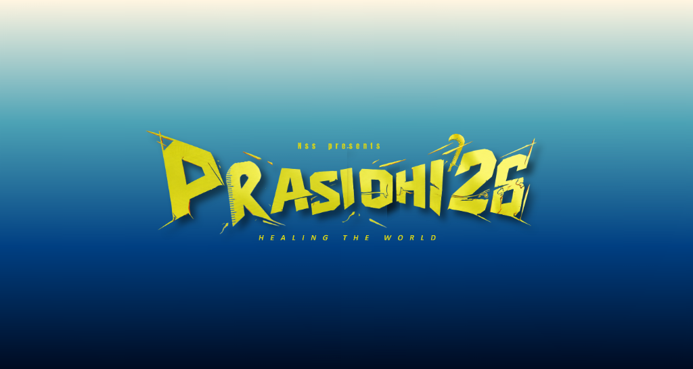

# Prasidhi 2k26 - Healing the World



Prasidhi 2k26 is a National Level Symposium organized by the National Service Scheme (NSS) of Kongu Engineering College, Perundurai. The event serves as a platform for students, innovators, researchers, and aspiring entrepreneurs from various institutions to showcase their talents, exchange ideas, and contribute towards building a sustainable future.

With the theme **"Healing the World"**, Prasidhi 2k26 encourages participants to develop innovative solutions that address real-world environmental and social challenges.

## 🚀 Features
- **Modern UI:** Built with HTML, CSS, and vanilla JS featuring a stunning glassmorphism design.
- **Dynamic Countdown:** A live countdown timer ticking down to the symposium start date.
- **Event Showcases:** Categorized displays of Technical and Non-Technical events.
- **Responsive Registration:** Beautifully styled Registration Pack cards linking seamlessly to Google Forms.
- **Image Gallery:** An interactive grid showcasing moments from previous events and campus life.
- **FAQ Section:** An interactive accordion layout answering common queries.

## 📅 Event Schedule
- **08:30 AM:** Registration & Welcome Kit Distribution
- **09:30 AM:** Inaugural Ceremony & Theme Presentation
- **10:30 AM:** Technical Events
- **01:00 PM:** Lunch Break & Networking
- **02:00 PM:** Non-Technical & Fun Events
- **04:30 PM:** Valedictory Function & Prize Distribution

## 🛠️ Built With
- HTML5
- CSS3 (Variables, Flexbox, CSS Grid, Glassmorphism)
- JavaScript (Vanilla DOM manipulation)
- [Font Awesome](https://fontawesome.com/) (Icons)
- [Google Fonts](https://fonts.google.com/) (Bangers, Plus Jakarta Sans, Space Grotesk)

## 📁 Project Structure

```
Prasidhi/
│
├── index.html       # The main landing page
├── style.css        # Core stylesheet (Design tokens, UI components, layout)
├── script.js        # Site interactivity (Countdown timer, scroll effects)
└── assets/          # Directory containing all images, logos, and gallery photos
```

## 💻 Local Development
This project is built using vanilla web technologies and does not require a build step or package manager.

1. Clone the repository:
   ```bash
   git clone https://github.com/pugazhendhi-dpm/Prasithi2K26.git
   ```
2. Navigate into the directory:
   ```bash
   cd Prasithi2K26
   ```
3. Open `index.html` directly in your browser, or use a local server like VS Code's Live Server extension.

## 🏆 Prizes
Participants compete for prizes worth **INR 15,000** along with certificates for all participants!

## 📞 Contact Information
For any inquiries regarding the symposium or registration, reach out to the event coordinators:
- R. Manoj - 8903026773
- V. Kabil - 9361090547
- G. Sabarinathan - 9361358813

---
*Organized by NSS - Kongu Engineering College*
